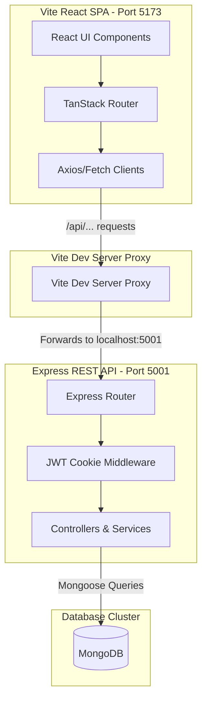

# 🚗 AutoCare Nepal — Premium Automotive Service Booking & Tracking Platform

AutoCare Nepal is a state-of-the-art, fully featured automotive service booking, real-time tracking, and administrative management platform tailored specifically for the Nepalese market. Built as a high-performance **MERN Stack** application, it provides a comprehensive end-to-end portal for vehicle owners (customers), service technicians, operators, and platform administrators.

---

## 🌟 Core System Modules

### 👤 Customer Experience Portal
* **Dynamic Service Catalog**: Interactive showcase of standard automotive services (detailing, foam washing, wheel alignment, oil replacement, general repairs) detailing features, price lists, and approximate service durations.
* **Multi-Step Checkout**: Frictionless, interactive booking flow gathering vehicle details, pickup/drop logistics preferences, calendar scheduling slots, and integrated digital payment choices.
* **Real-Time Service Tracker**: Live timeline milestones showing service progress from confirmed booking, through vehicle inspection, service-in-progress, quality checks, to final readiness.
* **Persisted Chat Support**: Instant chat connection to automated customer support with simulated smart responses.
* **Loyalty & Tier Dashboard**: Automatic point accumulation on checkout (10% of order price) with progression levels (Bronze, Silver, Gold, Platinum) and reward unlock meters.
* **Digital Garage**: Add, edit, and select from stored customer vehicles for fast checkouts.

### 📊 Administrative Dashboard
* **Analytics Visualization**: Dynamic monthly revenue charts, service demand distribution pie charts, and weekly booking trends using `Recharts`.
* **Operations Manager**: Complete database table views of bookings and status indicators.
* **Technician Dispatch**: Assign specific service technicians and estimate vehicle delivery times (ETA).
* **Customer Logbook**: Live index of customers, account standings, and account suspension controls.

### 🛡️ Superadmin Security Center
* **Immutable Audit Logs**: Fully logged user actions (registrations, system logins, checkout creations, and status revisions) with severity markers (`info`, `warn`, `critical`).
* **Role & Access Manager**: Complete matrix view of user roles (Customer, Admin, Superadmin) and permission groups.
* **Live Attack Shield**: Computerized status dashboards displaying simulated traffic loads and network threats.

---

## 💳 Payment Gateway Integrations

AutoCare Nepal integrates the two most popular digital payment systems in Nepal: **eSewa** and **Khalti**.

### 1. eSewa Integration (e-Pay v2 REST Protocol)
We utilize eSewa's modern **e-Pay v2** protocol for booking checkouts:
* **Signature Generation**: The backend generates an HMAC-SHA256 signature using the secret key (`8gBm/:&EnhH.1/q`) on the payload parameters (`total_amount`, `transaction_uuid`, `product_code`).
* **Secure Client Submission**: The server returns the signed configuration parameters. The frontend generates a hidden HTML form programmatically and posts it securely to eSewa's gateway endpoint (`rc-epay.esewa.com.np`).
* **Status Lookup & Verification**: Upon user redirection, the backend issues an API verification request with the signed parameters to verify payment legitimacy before finalizing the booking.

### 2. Khalti Integration (KPG-1 Sandbox Popup Widget)
To maintain compatibility with standard test credentials without requiring account upgrades, we support the classic **Khalti KPG-1 popup widget**:
* **Frontend Widget Invocator**: The frontend dynamically loads the script `khalti-checkout.iffe.js` and opens the login dialog directly within the portal using the public test credentials (`test_public_key_617c4c6fe77c441d88451ec1408a0c0e`).
* **Test Accounts Supported**:
  * **Test Khalti Mobile IDs**: `9800000000` through `9800000005`
  * **Sandbox MPIN**: `1111`
  * **Sandbox OTP**: `987654`
* **Secure Backend Verification**: Once successful, the frontend receives a `token` and `amount` payload. It forwards these to the server verification endpoint, which validates the payment against Khalti's live validation route (`https://khalti.com/api/v2/payment/verify/`) with the test secret key (`test_secret_key_3f78fb6364ef4bd1b5fc670ce33a06f5`).

---

## 📈 Growth Metrics Delta Analytics

To provide administrators with real-time operational feedback, our dashboard analytics engine calculates month-over-month growth values for **Revenue** and **Bookings**:
* **Baseline Initialization**: The system aggregates bookings by month. To handle empty databases, newly seeded databases, or the start of new calendar months, the engine pre-populates the array with the current and previous months (initialized to `0`).
* **Growth Delta Logic**:
  * If both months have active data, growth is calculated as:
    $$\text{Delta} = \frac{\text{Current Month} - \text{Previous Month}}{\text{Previous Month}} \times 100$$
  * If the previous month had `0` bookings and the current month has active transactions, growth is set to a clean `+100%` baseline rather than breaking or displaying `0%`.

---

## 🛠️ Technology Stack

| Layer | Technology | Key Libraries |
| :--- | :--- | :--- |
| **Frontend** | React 19 (SPA) | Vite, TanStack Router (Fully Type-Safe), TanStack Query, Tailwind CSS, Recharts, Sonner, Lucide React |
| **Backend** | Node.js, Express.js | JSON Web Tokens (JWT), BcryptJS, Cookie Parser, CORS, Dotenv |
| **Database** | MongoDB | Mongoose (ODM), Automatic Database Seeding |

---

## 📐 System Architecture

The following diagram maps out the data flow and reverse-proxy interface of the application:



---

## 🔌 REST API Endpoints

### 🔐 Authentication & Session
* `POST /api/auth/register`: Register new customer profiles.
* `POST /api/auth/login`: Validate credentials and issue HTTP-only JWT `auth_session` cookies.
* `POST /api/auth/logout`: Destroy user cookie sessions and write an audit log entry.
* `GET /api/auth/me`: Decodes cookies to return the active logged-in user profile.
* `PATCH /api/auth/profile`: Update user information (vehicle garage additions, addresses, phone numbers).

### 📅 Booking Operations
* `POST /api/bookings`: Create a new booking, increment loyalty points, and update tiers.
* `GET /api/bookings`: Fetch current bookings (customers only see their own, admins see all).
* `GET /api/bookings/verify-payment`: Verify eSewa or Khalti payments before saving confirmation.
* `PATCH /api/bookings/:id/status`: Update booking statuses, dispatch technicians, and set ETA (Admin only).
* `PATCH /api/bookings/:id/cancel`: Cancel bookings (user ownership or admin roles required).

### 📊 Management & Security
* `GET /api/admin/analytics`: Computes revenues, totals, service mix shares, and monthly arrays (Admin/Superadmin only).
* `GET /api/superadmin/audit`: Fetch last 50 platform audit logs (Superadmin only).

---

## 🚀 Setup & Installation (From Scratch)

Follow these steps to set up and run the application locally on your machine:

### 1. Prerequisites
Ensure you have the following software installed:
* **Node.js** (v18 or higher recommended)
* **MongoDB Community Server** (running locally on default port `27017`)
* **npm** (comes pre-packed with Node.js)

---

### 2. Step-by-Step Setup

#### Step A: Clone and Navigate
Clone your repository to your local workspace and navigate into the root directory:
```bash
git clone https://github.com/dipen-dra/AC_N.git
cd AC_N
```

#### Step B: Configure Environment Variables
1. Navigate to the `server` directory.
2. Copy the `.env.example` file to create your active `.env` file:
   ```bash
   cp server/.env.example server/.env
   ```
3. Open `server/.env` and update the variables if necessary. The default configuration connects to your local MongoDB instance at `mongodb://127.0.0.1:27017/autocare_nepal`.

#### Step C: Install Dependencies
Run the installation script in the project root folder. This single command installs packages concurrently for the root script runner, backend `/server`, and frontend `/client`:
```bash
npm run install:all
```

---

### 3. Launching the System & Data Seeding

#### Step A: Start the Development Server
Run the concurrent dev script from the project root:
```bash
npm run dev
```
This launches:
* **React Client SPA (Vite)**: Hosted at [http://localhost:5173](http://localhost:5173)
* **REST API Server (Express)**: Hosted at [http://localhost:5001](http://localhost:5001)

#### Step B: Automatic Database Seeding
Upon connecting to MongoDB for the first time:
1. The system checks if core databases (services and admin users) are seeded.
2. If the total number of bookings in the database is less than 5, **the server automatically seeds 6 months of historical customer data, 70+ bookings, and 30+ audit logs**!
3. This guarantees your dashboard charts, weekly trends, revenue lists, and security audit logs populate with rich historical visuals instantly on start.

---

### 4. Database Controls (Optional)

#### Force-Reset & Re-Seed
If you ever want to completely clean your local MongoDB instance and trigger a fresh re-seed of the 6-month historical database, run this Node utility script from the project root:
```bash
node -e 'const mongoose = require("mongoose"); mongoose.connect("mongodb://127.0.0.1:27017/autocare_nepal").then(async () => { await mongoose.connection.db.collection("bookings").deleteMany({}); await mongoose.connection.db.collection("users").deleteMany({ role: "Customer" }); await mongoose.connection.db.collection("auditlogs").deleteMany({}); console.log("Database cleared successfully."); process.exit(0); });'
```
After executing this, restart your development server (`npm run dev`) and the backend will seed all databases fresh!

---

## 👤 Seeded Test Accounts

The MongoDB database automatically seeds the following credentials upon first server launch:

| Account Type | Email | Password | Access Level |
| :--- | :--- | :--- | :--- |
| **Customer** | `user@autocare.com` | `password123` | Personal Bookings, Live Tracking, Chat |
| **Admin** | `admin@autocare.com` | `password123` | Booking management, Technician dispatch, Live Analytics |
| **Superadmin** | `super@autocare.com` | `password123` | System Security, Access Roles, Audit Logs |

---

## 📧 Email Notification Service (SMTP) Setup Guide

AutoCare Nepal includes an email notification system using **NodeMailer** that triggers transaction emails automatically for:
* **Booking Creation**: Sent when a user successfully checks out (Cash/Card/eSewa/Khalti).
* **Booking Status Revisions**: Sent when administrators assign a mechanic or update the work progress.
* **Booking Cancellation**: Sent immediately if a customer or admin cancels the service slot.

### Setup Instructions (e.g., using Gmail):

1. **Activate Two-Factor Authentication (2FA)**:
   * Go to your Google Account security settings.
   * Ensure **2-Step Verification** is turned ON for your email.
   
2. **Generate an App Password**:
   * Under your Google Account's 2-Step Verification settings page, scroll to the bottom and click on **App passwords**.
   * Select **Mail** as the app and **Other (Custom name)** as the device (enter "AutoCare Nepal").
   * Copy the generated **16-character security passcode** (without spaces).

3. **Configure Environment Variables**:
   * Open `/server/.env` and update the SMTP fields:
     ```env
     SMTP_HOST=smtp.gmail.com
     SMTP_PORT=587
     SMTP_USER=your-email@gmail.com
     SMTP_PASS=your-16-character-passcode
     SMTP_FROM="AutoCare Nepal" <no-reply@autocare.com.np>
     ```

4. **Mock Mode (Default)**:
   * If the `SMTP_USER` and `SMTP_PASS` parameters contain default placeholders, the mailer runs in **Mock Logging Mode**.
   * In this mode, booking notifications are formatted and logged straight to the backend terminal window instead of making network calls, preventing server crashes during offline testing.
