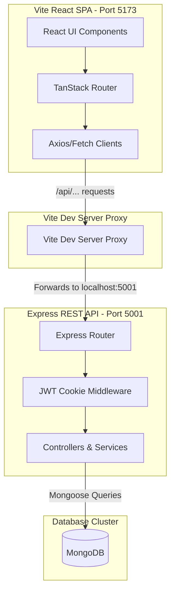

# 🚗 AutoCare Nepal — Premium Automotive Service Booking & Tracking Platform

AutoCare Nepal is a state-of-the-art, fully featured automotive service booking, real-time tracking, and administrative management system. Built as a high-performance **MERN Stack** application, it provides a comprehensive end-to-end portal for vehicle owners, service technicians, administrators, and super-administrators.

---

## 🌟 Key Highlights & Features

### 👤 Customer Experience Portal
*   **Dynamic Service Catalog**: Interactive display of standard auto services (foam washes, alignment, oil changes, detailing) with pricing, duration, and feature breakdown.
*   **Multi-Step Checkout**: Frictionless, interactive booking flow gathering vehicle details, pickup selection (pickup/drop), calendar slotting, and secure payment selections.
*   **Real-Time Service Tracker**: Live timeline milestones showing service progress from confirmed booking, through vehicle inspection, service-in-progress, quality checks, to final readiness.
*   **Support Chat Assistant**: Fully persisted support chat with simulated automated support replies.
*   **Loyalty & Tier Dashboard**: Automatic point accumulation on checkout (10% of order price) with progression levels (Bronze, Silver, Gold, Platinum) and reward unlock meters.
*   **Profile & Vehicle Garage**: Add/manage personal metadata and digital vehicle listings.

### 📊 Administrative Dashboard
*   **Analytics Visualization**: Dynamic monthly revenue charts, service demand distribution pie charts, and weekly booking trends using `Recharts`.
*   **Operations Manager**: Complete database table views of bookings and status indicators.
*   **Technician Dispatch**: Assign specific service technicians and estimate vehicle delivery times (ETA).
*   **Customer Logbook**: Live index of customers, account standings, and account suspension controls.

### 🛡️ Superadmin Security Center
*   **Immutable Audit Logs**: Fully logged user actions (registrations, system logins, checkout creations, and status revisions) with severity markers (`info`, `warn`, `critical`).
*   **Role & Access Manager**: Complete matrix view of user roles (Customer, Admin, Superadmin) and permission groups.
*   **Live Attack Shield**: Computerized status dashboards displaying simulated traffic loads and network threats.

---

## 🛠️ Technology Stack

| Layer | Technology | Key Libraries |
| :--- | :--- | :--- |
| **Frontend** | React 19 (SPA) | Vite, TanStack Router (Fully Type-Safe), TanStack Query, Tailwind CSS, Recharts, Sonner, Lucide React |
| **Backend** | Node.js, Express.js | JSON Web Tokens (JWT), BcryptJS, Cookie Parser, CORS, Dotenv |
| **Database** | MongoDB | Mongoose (ODM), Automatic Database Seeding |

---

## 📐 System Architecture

The following Mermaid diagram maps out the data flow and reverse-proxy interface of the application:



---

## 🗄️ Database Schema & Models

The platform uses five structured Mongoose collections:

### 1. `User` Schema
```javascript
{
  id: String,           // Custom user ID (e.g. U-1234)
  name: String,         // Account full name
  email: String,        // Unique normalized email
  phone: String,        // Contact number
  passwordHash: String, // Blowfish Bcrypt hash
  points: Number,       // Loyalty points balance
  tier: String,         // Bronze, Silver, Gold, Platinum
  initial: String,      // Letter initials for avatar
  status: String,       // Active, Suspended
  role: String          // Customer, Admin, Superadmin
}
```

### 2. `Booking` Schema
```javascript
{
  id: String,           // Booking reference (e.g. AC-20260515-123456)
  customer: String,     // Customer name
  customerEmail: String,// Customer email (foreign key reference)
  service: String,      // Type of service (e.g. Full Servicing)
  vehicle: String,      // Vehicle make & number
  date: String,         // Scheduled date
  time: String,         // Scheduled time slot
  location: String,     // Pickup address
  price: Number,        // Servicing cost in Rs.
  status: String,       // Upcoming, Confirmed, In Progress, Completed, Cancelled
  technician: String,   // Assigned mechanic name
  eta: String           // Estimated vehicle delivery time range
}
```

### 3. `Service` Schema
```javascript
{
  id: String,           // Custom service ID (e.g. S-1)
  name: String,         // Service name
  desc: String,         // Detail description
  price: Number,        // Standard rate
  duration: String,     // Estimated service duration
  category: String,     // Wash, Maintenance, General, Detailing, Repairs
  popular: Boolean,     // Badge indicator
  features: [String]    // Key items included
}
```

### 4. `ChatMessage` Schema
```javascript
{
  userEmail: String,    // User chat identification
  role: String,         // user, bot
  text: String,         // Message text
  time: String          // Send timestamp
}
```

### 5. `AuditLog` Schema
```javascript
{
  id: String,           // Log ID reference
  userEmail: String,    // Action trigger email
  action: String,       // Activity name
  entity: String,       // Target item (e.g. User · U-1)
  ip: String,           // Client IP address
  time: String,         // Action timestamp
  severity: String      // info, warn, critical
}
```

---

## 🔌 REST API Endpoints

### 🔐 Authentication APIs
*   `POST /api/auth/register`: Create a new customer profile.
*   `POST /api/auth/login`: Validate credentials and drop HTTP-only JWT `auth_session` cookie.
*   `POST /api/auth/logout`: Destroy JWT cookie session and write audit log.
*   `GET /api/auth/me`: Decodes JWT token and returns active user metadata.

### 🛠️ Service Catalog APIs
*   `GET /api/services`: Retrieve standard catalog lists.

### 📅 Booking Manager APIs
*   `GET /api/bookings`: Fetch user bookings (auto-isolated by JWT cookie, returns all for Admins).
*   `GET /api/bookings/:id`: Retrieve detailed booking status by reference ID.
*   `POST /api/bookings`: Create a new service booking, increment user loyalty points, and update tiers.
*   `PATCH /api/bookings/:id/status`: Edit booking status, assign technician, and set ETA (Admin/Superadmin only).

### 💬 Chat APIs
*   `GET /api/chat`: Load user support chat history.
*   `POST /api/chat`: Save client messages.

### 📊 System Security & Analytics
*   `GET /api/admin/analytics`: Computes revenues, totals, service mix shares, and monthly arrays (Admin/Superadmin only).
*   `GET /api/superadmin/audit`: Fetch last 50 platform audit logs (Superadmin only).

---

## 🚀 Setup & Installation

### 1. Configure the Environment
Create a `.env` file in the `/server` directory:
```env
PORT=5001
MONGO_URI=mongodb://127.0.0.1:27017/autocare_nepal
JWT_SECRET=your_custom_jwt_secret_key_here
NODE_ENV=development
```

### 2. Install Project Dependencies
Run this command in the project root directory to automatically install packages for the root, frontend client, and backend server:
```bash
npm run install:all
```

### 3. Launch Development Mode
Launch both servers concurrently with a single command:
```bash
npm run dev
```
*   **Vite Frontend Dev Host**: `http://localhost:5173/` (reverse proxied `/api` to port 5001)
*   **Express API Host**: `http://localhost:5001/`

---

## 👤 Seeded Test Accounts

The MongoDB database automatically seeds the following credentials upon first server launch:

| Account Type | Email | Password | Access Level |
| :--- | :--- | :--- | :--- |
| **Customer** | `user@autocare.com` | `password123` | Personal Bookings, Live Tracking, Chat |
| **Admin** | `admin@autocare.com` | `password123` | Booking management, Technician dispatch, Live Analytics |
| **Superadmin** | `super@autocare.com` | `password123` | System Security, Access Roles, Audit Logs |
